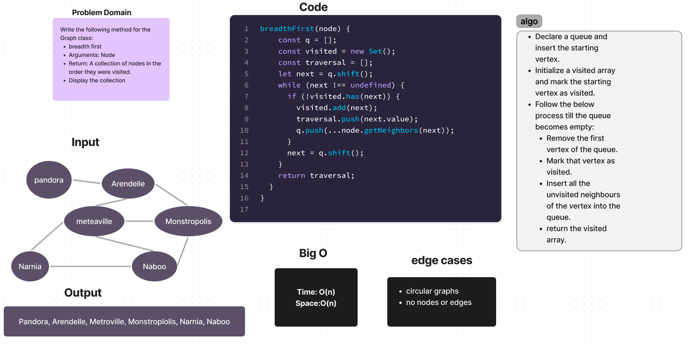

# Challenge Setup & Execution

Branch Name: `graph-breadth-first`

Challenge Type: Extending an Implementation

## Feature Tasks

Write the following method for the Graph class:

- breadth first
- Arguments: Node
- Return: A collection of nodes in the order they were visited.
- Display the collection

[PR](https://github.com/SarahTek/data-structures-and-algorithms-401/pull/91)

