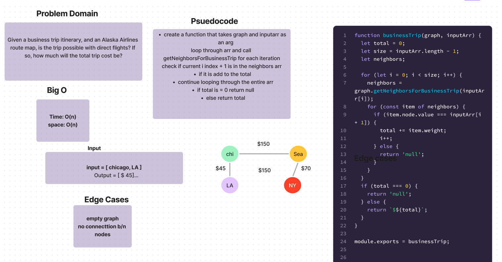

# Challenge Setup & Execution

Branch Name: `graph-business-trip`

Challenge Type: Code Challenge / Algorithm

## Feature Tasks

- Write a function called business trip
- Arguments: graph, array of city names
- Return: the cost of the trip (if it’s possible) or null (if not)
Determine whether the trip is possible with direct flights, and how much it would cost.

## 

## [PR](https://github.com/SarahTek/data-structures-and-algorithms-401/pull/94)

## Collaborators

- Danny
- Tony
