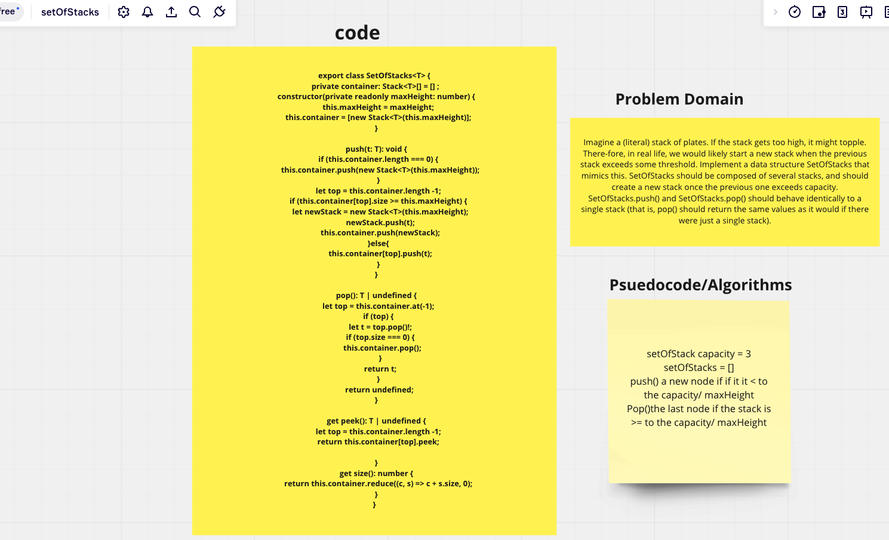

## Set Of Stacks Code Challenge

- Imagine a (literal) stack of plates. If the stack gets too high, it might topple. There-fore, in real life, we would likely start a new stack when the previous stack exceeds some threshold. Implement a data structure SetOfStacks that mimics this. SetOfStacks should be composed of several stacks, and should create a new stack once the previous one exceeds capacity. SetOfStacks.push() and SetOfStacks.pop() should behave identically to a single stack (that is, pop() should return the same values as it would if there were just a single stack).

```
class SetOfStacks {
  constructor(private readonly maxHeight: number) {}
  
  push(t: T): void;
  pop(): T;
  get peek(): T;
}
```

## PR for code challenge 11

- [PR for Set of Stacks](https://github.com/SarahTek/data-structures-and-algorithms-401/pull/40)

## Set of Stacks UML



### Collaborators

- Tony
