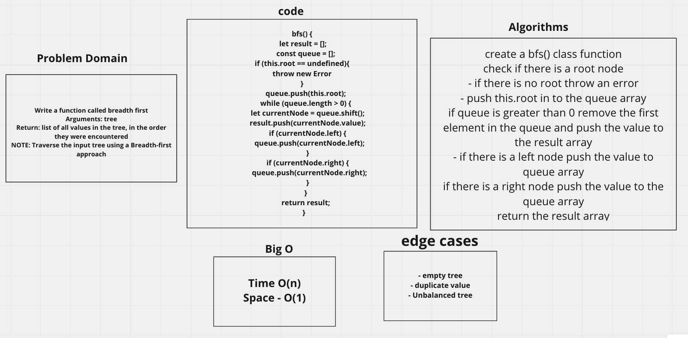
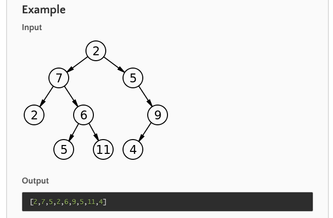

## Feature Tasks

Write a function called `breadth first`

- Arguments: tree
- Return: list of all values in the tree, in the order they were encountered

NOTE: Traverse the input tree using a Breadth-first approach


## UML for  Breadth-first



## Solution 

```
bfs() {
 let result = [];
    const queue = [];
    queue.push(this.root);
    while (queue.length > 0) {
      let currentNode = queue.shift();
      result.push(currentNode.value);
      if (currentNode.left) {
        queue.push(currentNode.left);
      }
      if (currentNode.right) {
        queue.push(currentNode.right);
      }
    }
    return result;
  }
  ```
