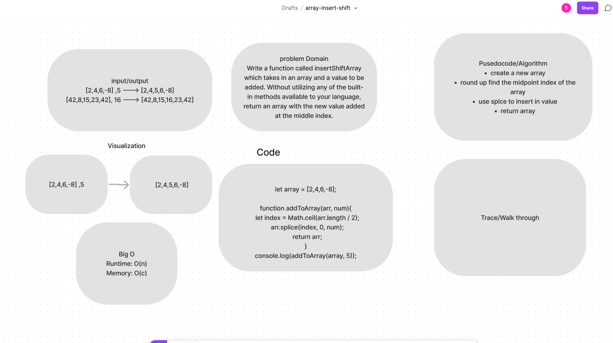

# array-insert-shift

Feature Tasks
Write a function called insertShiftArray which takes in an array and a value to be added. Without utilizing any of the built-in methods available to your language, return an array with the new value added at the middle index.

## Whiteboard Process

## Approach & Efficiency

- we worked as a team with Justin and Daniel.
- created a new array
round up find the midpoint index of the array
- use splice to insert in value
- pushed a value to middle index
- returned an array

## Collaborators

- Justin Matieu
- Daniel Castro
