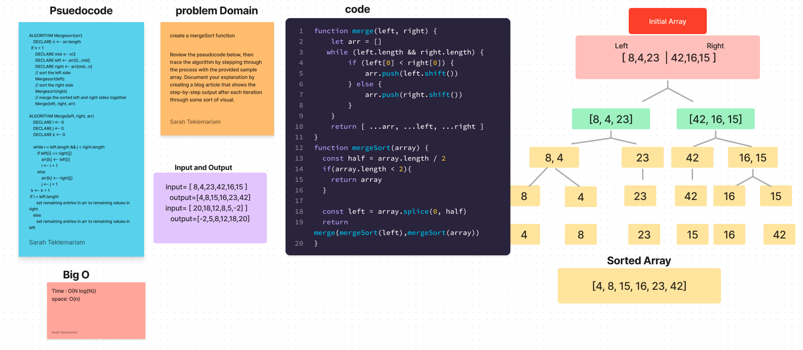

# Merge Sort

Review the pseudocode below, then trace the algorithm by stepping through the process with the provided sample array. Document your explanation by creating a blog article that shows the step-by-step output after each iteration through some sort of visual.

Merge sort uses the concept of divide-and-conquer to sort the given list of elements. It breaks down the problem into smaller subproblems until they become simple enough to solve directly.

Here are the steps Merge Sort takes:

- Split the given list into two halves (roughly equal halves in case of a list with an odd number of elements).
- Continue dividing the subarrays in the same manner until you are left with only single element arrays.
- Starting with the single element arrays, merge the subarrays so that each merged subarray is sorted.
- Repeat step 3 unit with end up with a single sorted array.

I want to give credit to this [article](https://stackabuse.com/merge-sort-in-javascript/) by Abhilash Kakumanu. it helped me better understand Merge Sort.

- To run the test I used npm run merge-sort.test.js
