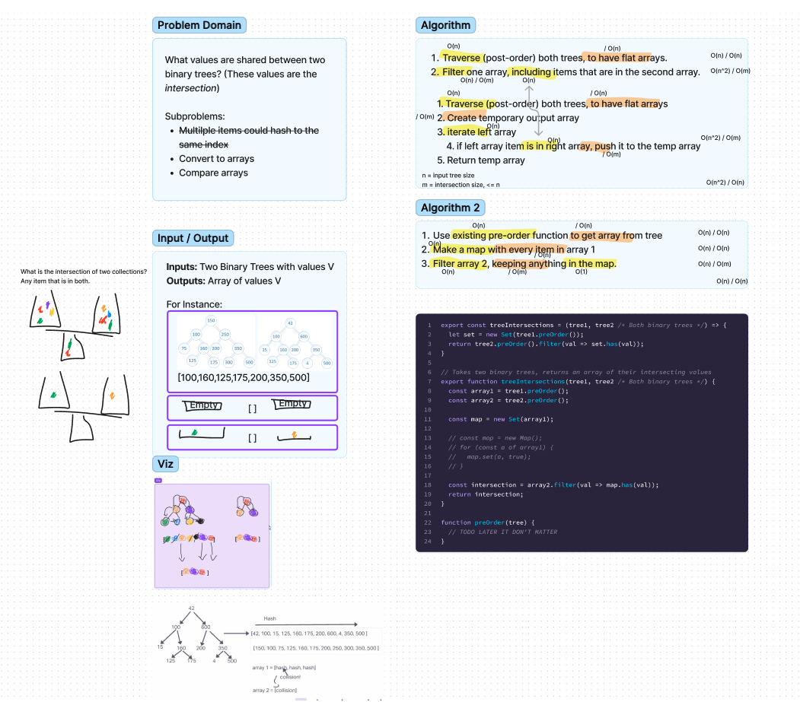

# Feature Tasks

- Write a function called `tree_intersection` that takes two binary trees as parameters.
- Using your Hashmap implementation as a part of your algorithm, return a set of values found in both trees.

## Approach and efficiency

- we use the preOrder traversal method , `set`, `filter` and also `has`

## Collaborators

- We worked on this code challenge with danny and then we did it as a group in class.
